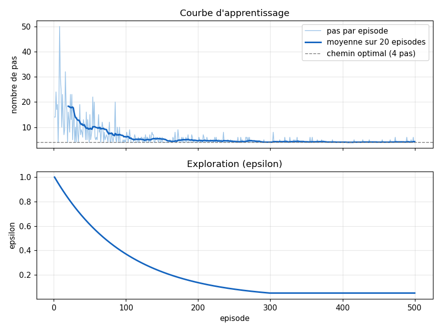

# Labyrinth 3x3 Q-Learning

## Les fichiers
 
- `apprentissage.py` : l'entraînement. Il affiche le tableau Q, le chemin trouvé, puis deux graphiques (nombre de pas par épisode et évolution d'epsilon).
- `simulation.py` : une petite fenêtre Tkinter où on voit l'agent entraîné suivre son chemin, case par case.


| Paramètre | Valeur | Rôle |
|---|---|---|
| `ALPHA` | 0.1 | vitesse d'apprentissage |
| `GAMMA` | 0.9 | importance des récompenses futures |
| `EPSILON_DEBUT` | 1.0 | exploration au début |
| `EPSILON_MIN` | 0.05 | exploration minimale |
| `DECROISSANCE` | 0.99 | vitesse de baisse d'epsilon |
| `NB_EPISODES` | 500 | nombre de parties d'entraînement |
| `MAX_PAS` | 50 | nombre de pas maximum par partie |
| `GRAINE` | 0 | pour avoir les mêmes résultats à chaque lancement |

## Lancer le projet
 
Il faut Python 3 avec `numpy` et `matplotlib` (Tkinter est fourni avec Python).
 
```
pip install numpy matplotlib
```
 
Pour l'entraînement et les graphiques :
 
```
python apprentissage.py
```
 
Pour la simulation :
 
```
python simulation.py
```
 
Cliquez sur **Démarrer** pour lancer l'agent et sur **Recommencer** pour le remettre au départ. Pour quitter, fermez simplement la fenêtre. Sous Windows, elle s'ouvre parfois derrière l'éditeur.

## Fonctionnement
 
L'agent garde un tableau `Q` qui donne, pour chaque case et chaque direction (haut, bas, gauche, droite), une note : « est-ce que c'est une bonne idée d'aller par là ? ».
 
À chaque déplacement, il met cette note à jour avec la formule du Q-learning :
 
```
Q(s, a) <- Q(s, a) + alpha * (r + gamma * max Q(s', .) - Q(s, a))
```
 
Les récompenses :
- +1 quand il atteint la sortie ;
- -0.1 pour chaque pas, pour qu'il cherche le chemin le plus court.
Pour ne pas rester bloqué sur ses premières idées, l'agent explore parfois au hasard. C'est le paramètre `epsilon` : il vaut 1 au début (tout au hasard), puis il diminue à chaque épisode jusqu'à 0.05. Au début l'agent découvre, à la fin il exploite ce qu'il a appris.

## Résultat
 
Après 500 épisodes, l'agent trouve un chemin de 4 pas, le plus court possible, par exemple `0 -> 3 -> 4 -> 5 -> 8`. Dans la simulation, le score final est de 0.7 (trois pas à -0.1, puis +1 à l'arrivée).
 

 
Sur la courbe, on voit l'agent mettre jusqu'à 50 pas lors des premiers épisodes, puis se stabiliser autour de 4 pas.
